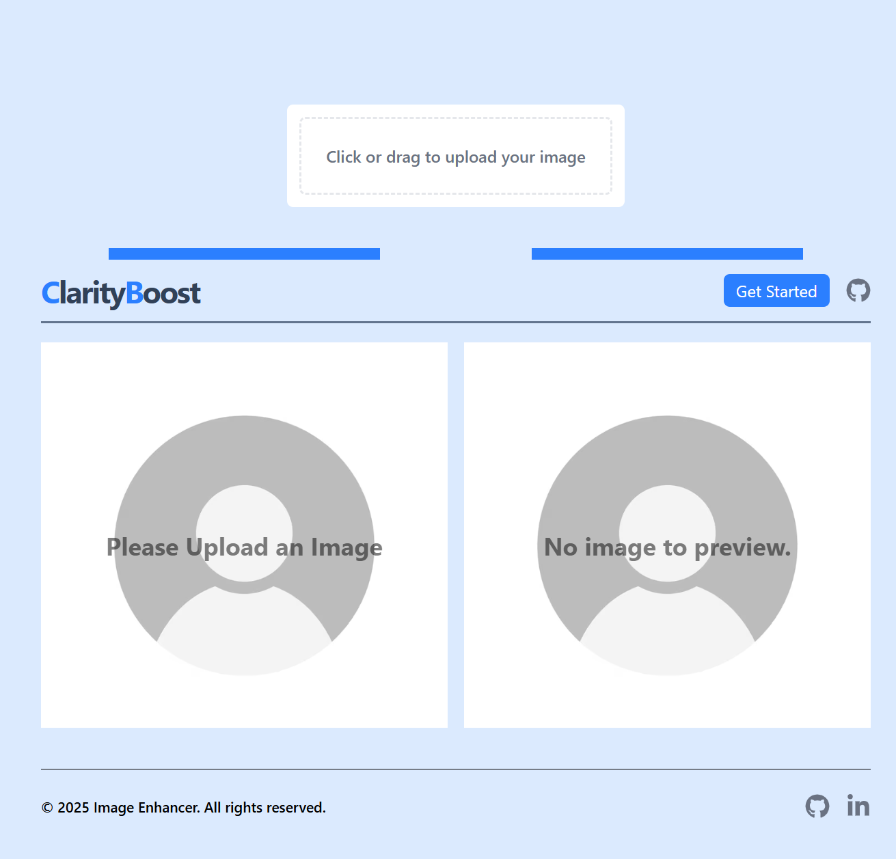

# ClarityBoost 🔍✨

ClarityBoost is a web application designed to enhance image quality using the powerful **PicWish Image Enhancer API**. Whether your image is blurry, low resolution, or lacking sharpness, ClarityBoost improves its clarity and visual appeal with just a click.

## 🚀 Features

- 📷 Upload any image to enhance
- ⚙️ Seamless integration with [PicWish Image Enhancer API](https://picwish.com/api)
- 💡 One-click enhancement
- 📁 Download the enhanced version
- 🖥️ Clean and responsive UI

## 🛠️ Tech Stack

- **Frontend:** React / TailwindCSS
- **API:** PicWish Image Enhancer

## 🧪 How It Works

1. User uploads an image through the UI.
2. The image is sent to the PicWish API for processing.
3. The enhanced image is returned and displayed to the user.
4. User can download the enhanced version.

## 📦 Installation

1. Clone the repository:

   git clone https://github.com/Vishesh-21/ClarityBoost-Image-Enhancer
   cd ClarityBoost

2. Install dependencies:

   npm install

3. Create a .env file and add your PicWish API key:

   VITE_VITE_PICWISH_API_KEY = "Your api key"

4. Start the development server:

   npm run dev

## 🔐 API Key

To get a PicWish API key, visit https://picwish.com/api and sign up. You will need this key to use the enhancer functionality.

---

## ScreenShot

## 🙌 Acknowledgements

PicWish API for the image enhancement capabilities
OpenAI for helping brainstorm the structure 😄

---

✨ Improve clarity. Boost quality. Welcome to ClarityBoost.
